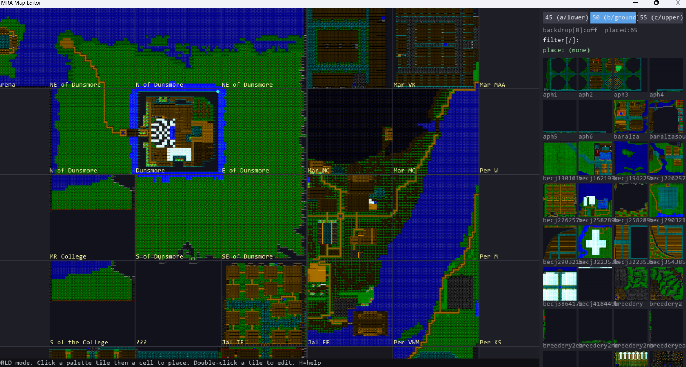

# MRA Mapmaker

A visual map editor for **Mystic Realms of Alhanzar** sector (`.SEC`) files. It reads and writes the
original `.SEC` format byte-for-byte, renders the real game tile art, and lets you place sectors into
the world across floor levels or edit any sector cell-by-cell in the style of the original SCB editor.



## Features

- **World placement** — arrange `.SEC` tiles on the world grid across the three floor levels
  (a/b/c = 45/50/55), with the cartographer's overview map as a reference backdrop, area labels, and
  stair markers. Export the layout as JSON.
- **Sector editing** — open any sector and paint terrain, walls, doors, and objects per cell, with
  the four directional edges for walls/doors, exactly as the original editor worked.
- **Real game art** — terrain, objects, walls, and doors render from the original `SCBART.256` /
  `PAL256` art, so the map looks like the game.
- **Faithful, safe saves** — writes the exact 6534-byte `.SEC` format (round-trip verified against
  the game's own reader). Edits are written to `edited/` so the originals are never touched.

## Requirements

- **Python 3.13 recommended.** (Python 3.14 has no pygame wheel yet, so installing pygame fails on
  it — use 3.13 until pygame ships a 3.14 build.)
- pygame — `pip install -r requirements.txt` (the launcher installs it for you on first run).

## Run

**Windows:** double-click **`run.bat`**. It finds Python, installs `pygame` the first time if needed,
then launches the editor — no terminal required.

**From a terminal** (or Git Bash / Linux / macOS via `./run.sh`):

```
python editor.py
```

You start in **World** mode. Press `B` for the reference backdrop, `1`/`2`/`3` to switch floors, and
**double-click any placed tile** to open the cell editor.

## Controls

**World mode**
- `1` `2` `3` — floor (lower / ground / upper)
- `B` — toggle the overview backdrop · `/` — type to filter the tile palette
- click a palette tile, then a cell — place · click a cell — select · `X` / `Del` — remove
- **double-click** a placed cell — edit that sector
- `Ctrl`+wheel — zoom at cursor · wheel — pan · middle-drag — pan
- `Ctrl`+`E` — export the placement to `placement.json`

**Sector mode**
- `T` `W` `D` `O` — pick category (Terrain / Wall / Door / Object), or click the buttons
- arrow keys — pick the edge for walls/doors
- click a type in the list (with preview icons) — select it
- left-click — paint · right-click — erase · drag — paint a run
- wheel — zoom at cursor · middle-drag — pan · `Ctrl`+`S` — save the `.SEC` · `Esc` — back

## Layout

```
editor.py     world + sector editor (pygame)
secio.py      read / write .SEC (byte-faithful)
sectext.py    lossless .SEC <-> .sectext text format + single-blob bundler
art.py        decode SCBART.256 / PAL256 tile art
render.py     sector -> rendered surface
scbdata.py    terrain / wall / door / object type names
assets/       SCBART.256, PAL256
data/         world_map.json, world_layout_full.json, overview backdrop,
              sectors.sectext (all sectors, one text blob — what the editor decodes),
              coordinate-maps/ (coordinate sectors), area-maps/ (area-named sectors)
formats/      SEC_FORMAT.md, SCB_type_names.txt  (format + type reference)
edited/       your saved sectors (output)
```

## Format

A `.SEC` is **6534 bytes = 33×33 cells × 6 bytes** (32×32 playable + a Void margin at row/col 32).
Cell `(r, c)` is at byte offset `(r*33 + c) * 6`, and each cell is 6 bytes:

| Byte | Field |
|------|-------|
| `b0` | terrain type |
| `b1` | object / feature (`1` = teleportal; others = furniture, trees, …) |
| `b2`–`b3` | walls + N-door, 16-bit LE word `w`: `n_wall = w & 31`, `w_wall = (w>>5) & 31`, `n_door = (w>>10) & 15` |
| `b4` | W-door: `w_door = (b4>>1) & 15` |
| `b5` | entity / critter index (links to `.CRT`) |

Door bits are only valid when the matching wall is non-zero. Neighboring sectors share a seam
(`west.col[31] == east.col[0]`, `north.row[31] == south.row[0]`).

The full byte layout plus the complete **terrain / wall / door / object type tables** are in
**[formats/SEC_FORMAT.md](formats/SEC_FORMAT.md)** (the type names alone are also in
**[formats/SCB_type_names.txt](formats/SCB_type_names.txt)**).

### `.sectext` — the readable, authored map format

The opaque binary `.SEC` blobs are also serialised to a single human-readable, diff-able text bundle,
**`data/sectors.sectext`**, which the editor decodes at startup (it falls back to the loose `.SEC`
folders if the bundle is absent). Each sector is one block introduced by a header carrying its
provenance, followed by one line per non-empty cell:

```
SECTOR iun1  set=area  rel=iun/iun1.SEC
5,7: terrain=20 nwall=1 wwall=1  # Grass, N:Stone, W:Stone
```

The conversion is **byte-exact** in both directions (`python sectext.py selftest` verifies all 496
sectors round-trip identically), so the binaries can always be regenerated and nothing is lost.

```
python sectext.py build              # (re)pack every .SEC into data/sectors.sectext
python sectext.py unbundle           # regenerate the .SEC tree from the bundle
python sectext.py encode f.SEC       # print one sector as annotated .sectext
python sectext.py decode f.sectext   # rebuild a single .SEC from text
python sectext.py selftest           # verify byte-exact round-trip on every map
```

## License

The tool (code and documentation) is released under the **MIT License** — see `LICENSE`.
The bundled game art and map data belong to the original game and are included for preservation —
see `NOTICE`.
